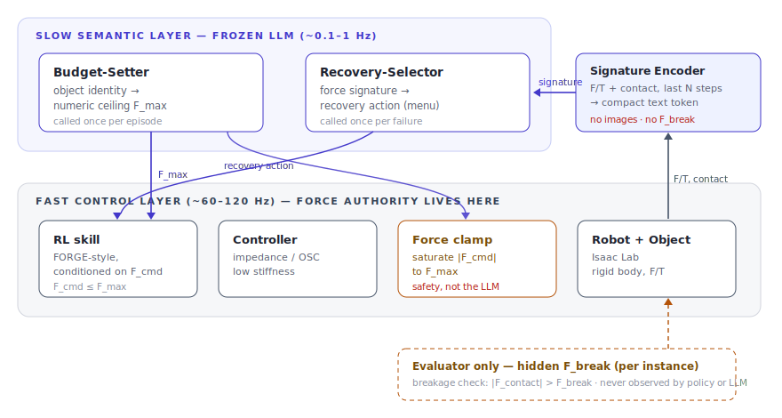

# FORGE-plus: Force-Budgeted Recovery

LLM-guided failure recovery for contact-rich assembly under per-object force ceilings.

A two-layer simulation study built on top of [FORGE](https://arxiv.org/abs/2408.04587) (RA-L 2025). Simulation-only · frozen LLM supervisor · single GPU · no real robot · no fracture modeling.

---

## What this is

FORGE showed that force-ceiling-conditioned RL skills transfer to real hardware. But it left two questions open:

1. **Who sets the ceiling?** FORGE autotunes `F_max` to maximize success. That works for indestructible parts. It fails when the same assembly line mixes a steel bolt with a nylon snap clip — the ceiling that seats the bolt strips the clip.

2. **What do you do on failure?** Existing LLM reasoners (REFLECT, DoReMi, AHA) read vision and re-plan at the task level. The information that distinguishes a wedge from a cross-thread from a burr lives in the *force trace*, not the pixels. And the obvious recovery — press harder — is exactly the move that destroys a fragile part.

FORGE-plus studies what happens when you close both gaps at once:

- A **frozen LLM** reads object identity and sets a per-object `F_max` before the episode starts.
- On failure, the same LLM reads a **compact force/contact signature** (no images) and picks a recovery from a fixed menu that has no "increase the ceiling" option.
- **Safety is enforced by a hardware clamp in the fast loop** — not by the language model.

---

## Simulation preview

25 Franka Panda arms training in parallel — one frame captured from the Isaac Sim headless renderer on a RunPod RTX 2000 Ada pod:


*Run `scripts/render_preview.py` to regenerate. See [`docs/rendering.md`](docs/rendering.md) for setup.*

---

## Architecture



> Full research proposal: [`docs/proposal.html`](docs/proposal.html)

Two layers, two rates, clean roles:

| Layer | Rate | Does | Does not |
|---|---|---|---|
| Slow (LLM) | ~0.1–1 Hz | Set `F_max` from identity; pick recovery from force signature | See `F_break`; touch the controller; raise the ceiling |
| Fast (RL+clamp) | 60–120 Hz | Execute skill; clamp commands to `F_max`; detect breakage | Query the LLM during control |

---

## Key design invariants

**`F_break` is never observed by the agent.** It is sampled once per episode, stored in the simulator, and read only by the evaluator's breakage check. The policy, encoder, budget-setter, and recovery-selector never see it. A runtime assertion in `SignatureEncoder.encode()` guards this at test time.

**`F_max` is immutable during recovery.** `RecoverySelector` always overwrites the LLM's `keep_F_max_N` back to the original value before it reaches the controller. Recovery reallocates *motion*, not force.

**Force authority is in the fast loop.** `ForceClamp` saturates the commanded wrench before every simulation step regardless of what the LLM said. A fixed global hard cap (120 N) is a second line of defense against hallucinated ceilings.

---

## Project layout

```
forge_plus/
├── llm/
│   ├── client.py             # Anthropic / OpenAI-compatible / Mock backends
│   ├── budget_setter.py      # Object identity → F_max (cached, range-validated)
│   └── recovery_selector.py  # Force signature → recovery action
├── encoding/
│   └── signature_encoder.py  # F/T history → compact text token (no images, no F_break)
├── control/
│   └── force_clamp.py        # Hard per-axis and scalar force ceiling enforcement
├── envs/
│   ├── base_assembly_env.py  # Abstract interface (decouples episode runner from sim)
│   ├── mock_assembly_env.py  # Lightweight CPU env for testing without Isaac Lab
│   ├── isaac_lab_env.py      # Isaac Lab implementation (requires GPU + isaaclab>=2.0)
│   └── object_configs.py     # 8 objects across 3 tasks, each with hidden F_break dist.
├── skills/
│   ├── policy_network.py     # FiLM-conditioned MLP — F_cmd modulates every hidden layer
│   └── forge_skill.py        # FORGE-style skill with running obs normalizer
├── recovery/
│   └── recovery_actions.py   # 5 primitives: retract, wiggle, rotate_align, regrasp, abort
├── evaluation/
│   ├── metrics.py            # 7 metrics from §10 of the proposal
│   └── baselines.py          # 6 baselines: no-ceiling → oracle
└── episode.py                # Closed-loop episode runner (the §7 algorithm)

scripts/
├── run_episode.py    # Run a single episode with verbose output
├── evaluate.py       # Full evaluation pipeline across all baselines
└── train_skill.py    # PPO training for the FORGE-style skill

configs/
├── tasks/            # Per-task YAML (objects, disturbances, success criteria)
├── objects/          # Object registry with identity and hidden fragility model
├── llm/              # LLM backend and prompt configuration
└── training/         # PPO hyperparameters
```

---

## Quickstart

**No GPU required for the LLM layer and tests.**

```bash
git clone https://github.com/robot-team00/FORGE-plus
cd FORGE-plus
pip install anthropic pydantic numpy scipy pyyaml rich torch pytest
```

Run a single episode (mock LLM, mock physics — no API key needed):

```bash
PYTHONPATH=. python scripts/run_episode.py \
    --object abs_round_connector \
    --task task1 \
    --backend mock
```

Run with the real Anthropic LLM (requires `ANTHROPIC_API_KEY`):

```bash
PYTHONPATH=. python scripts/run_episode.py \
    --object abs_round_connector \
    --task task1 \
    --backend anthropic
```

Run the full test suite:

```bash
PYTHONPATH=. python -m pytest tests/ -v
```

Evaluate all baselines on Task 1:

```bash
PYTHONPATH=. python scripts/evaluate.py \
    --task task1 \
    --n-episodes 100 \
    --backend anthropic
```

Train a skill (mock env, CPU — for real training substitute `--mock-env` with Isaac Lab):

```bash
PYTHONPATH=. python scripts/train_skill.py \
    --task task1 \
    --gripper franka_panda \
    --total-steps 5000000
```

---

## Tasks

| # | Name | What it isolates | Objects | Dominant failure |
|---|---|---|---|---|
| 1 | Single insertion | Budget-setting + clamp | ABS round connector (fragile) vs steel peg (robust) | Wedge jam vs friction jam — identical on camera, distinguishable in force |
| 2 | Multi-step assembly | Closed-loop recovery across a sequence | Resin planet gear (fragile) vs aluminium planet gear (robust) | Cross-thread / misalignment / tooth clash — each demands a different recovery within budget |
| 3 | Fragile place / stack | Ceiling + recovery *outside* tight insertion | Glass bowl, ceramic plate (fragile) vs aluminium tray, stoneware mug (robust) | Over-press / edge-load / tip — "press harder" is maximally destructive here |

Every task runs on both the **Franka Panda** and the **Robotiq 2F-140** (grasps seeded by [GraspGen](https://arxiv.org/abs/2507.13097)). Gripper becomes a generalization axis: `F_max` is derived from object identity and should be gripper-invariant; whether it actually is is a testable prediction.

---

## Objects

| Key | Material | F_break mean (N) | Task |
|---|---|---|---|
| `abs_round_connector` | ABS plastic | 38 ± 5 | Task 1 — fragile |
| `steel_peg` | Steel | 230 ± 20 | Task 1 — robust |
| `resin_planet_gear` | Photopolymer resin | 48 ± 8 | Task 2 — fragile |
| `metal_planet_gear` | Aluminium | 210 ± 18 | Task 2 — robust |
| `glass_bowl` | Borosilicate glass | 22 ± 4 | Task 3 — fragile |
| `ceramic_plate` | Stoneware ceramic | 26 ± 5 | Task 3 — fragile |
| `metal_plate` | Aluminium | 180 ± 25 | Task 3 — robust |
| `sturdy_mug` | Stoneware | 160 ± 20 | Task 3 — robust |

`F_break` is sampled per-instance from the class distribution at episode start. The LLM reasons about the *class*, not a memorized instance value.

---

## Baselines

| Baseline | Ceiling source | Recovery | Expected on fragile |
|---|---|---|---|
| No-ceiling skill | None (unbounded) | Retry as-is | High breakage |
| Fixed global ceiling | One `F_max` for all objects | Retry as-is | Forced tradeoff |
| **Press-harder** (Tactile-VLA-style) | Per-object `F_max` | Increase force | **Breaks fragile parts — by design** |
| Heuristic recovery | Per-object `F_max` | Hand-coded rules | Low breakage, moderate success |
| Vision-LLM recovery (REFLECT/AHA proxy) | Per-object `F_max` | LLM on rendered frame caption | Under-discriminates contact jams |
| Oracle ceiling (upper bound) | `F_break − ε` (cheats) | Ours | Near-zero breakage |
| **Ours** | Frozen LLM (identity) | Frozen LLM (force signature) | Target: match oracle on success, keep breakage low |

A result where the heuristic matches the LLM is a real and reportable negative — it weakens the claim that semantics are needed. A result where the vision-LLM proxy keeps up on jam failures weakens the force-grounding claim. Both outcomes are visible by design.

---

## Evaluation metrics

All metrics are computed from `EpisodeResult` objects by `forge_plus/evaluation/metrics.py`.

1. **Closed-loop multi-attempt success** — fraction seated within `K` attempts
2. **Breakage rate** — fraction with `|F_contact| > F_break` (non-circular: `F_break` is evaluator-only)
3. **Budget appropriateness** — distribution of `m = F_break − F_max`; over-budget rate; under-budget rate
4. **Recovery efficacy** — success conditional on a recovery being invoked; attempts-to-success
5. **Force economy** — peak and mean contact force per success
6. **Clamp fidelity** — mean/max overshoot of actual contact force above `F_max` (controller sanity check)
7. **Cross-gripper transfer** — per-gripper success and breakage rates; `|mean(F_max_panda) − mean(F_max_robotiq)|`

---

## LLM interface

The LLM is called at most twice per episode — once at the start and once per failure. Both calls are JSON in / JSON out with no images.

**Budget-setter input:**
```json
{
  "call": "set_force_ceiling",
  "object": {
    "name": "Ø8mm ABS round connector",
    "material": "ABS",
    "class": "round_connector",
    "nominal_mass_g": 6.2,
    "geometry_tags": ["thin_wall", "press_fit"]
  },
  "task": "insert_until_seated",
  "global_hard_cap_N": 120
}
```

**Budget-setter output (range-validated before reaching the controller):**
```json
{
  "F_max_N": 18.0,
  "per_axis_N": {"insertion": 18.0, "lateral": 8.0},
  "confidence": 0.62,
  "rationale": "Thin-wall ABS press-fit; seating needs only a modest axial push..."
}
```

**Recovery-selector input:**
```json
{
  "call": "select_recovery",
  "F_max_N": 18.0,
  "signature": {
    "peak_axial_N": 17.6,
    "net_insert_mm": 0.3,
    "axial_rising": true,
    "lateral_bias": "+x steady",
    "contact_persist_ms": 640,
    "slip_events": 0
  },
  "menu": ["retract_and_reapproach", "wiggle_search", "rotate_align", "regrasp", "abort"]
}
```

**Recovery-selector output:**
```json
{
  "action": "rotate_align",
  "params": {"yaw_deg": 3.0, "then": "wiggle_search"},
  "keep_F_max_N": 18.0,
  "rationale": "Axial force at the budget with no progress and a steady lateral bias..."
}
```

The menu has no "increase the ceiling" option. `keep_F_max_N` is overwritten to the original value server-side regardless of what the model returns.

---

## Configuring the LLM backend

Edit `configs/llm/default.yaml` or pass `--backend` to the scripts.

**Anthropic Claude (default):**
```yaml
backend: anthropic
model: claude-sonnet-4-6
cache: true
```
Requires `ANTHROPIC_API_KEY` in the environment.

**Local model (offline, no API key):**

```bash
# Recommended: Ollama + Qwen2.5-7B
ollama pull qwen2.5:7b-instruct
ollama serve

PYTHONPATH=. python scripts/run_episode.py \
    --object abs_round_connector --task task1 \
    --backend local
```

Override the server or model from the command line:

```bash
PYTHONPATH=. python scripts/run_episode.py \
    --backend local \
    --local-url http://localhost:8000/v1 \
    --local-model Qwen/Qwen2.5-14B-Instruct \
    --object glass_bowl --task task3
```

Or copy `configs/llm/local.yaml` and edit `base_url` / `model` for vLLM or llama.cpp — see that file for commented-out alternatives.

**Mock (for testing, no API key):**
```yaml
backend: mock
```

---

## Isaac Lab

Full GPU-parallel training requires [Isaac Lab](https://github.com/isaac-sim/IsaacLab) ≥ 2.0.

```bash
pip install isaaclab>=2.0.0
```

`forge_plus/envs/isaac_lab_env.py` implements `BaseAssemblyEnv` on top of Isaac Lab. The import is guarded so the rest of the package loads without it. `forge_plus/envs/mock_assembly_env.py` provides a CPU-only drop-in for tests and debugging.

Target training throughput: 1–4k parallel environments on a single RTX 4090 / L40 / A100. No rendering is needed — observations are proprioception, EE pose, and F/T, not images.

---

## Related work

| System | Our relation |
|---|---|
| [FORGE](https://arxiv.org/abs/2408.04587) (RA-L 2025) | We reuse the force-conditioned skill. The difference is who sets `F_max` and why. |
| [Tactile-VLA](https://arxiv.org/abs/2507.09160) (2025) | Its "press harder" recovery is our primary baseline. We differ in using a frozen LLM, a force-only signature, and a hard ceiling the recovery cannot cross. |
| [PaCo-VLA](https://arxiv.org/abs/2606.00515) (2026) | Shares the shield-retains-authority design. Its shield is a passivity contract, not a scalar peak-force clamp. |
| [REFLECT](https://arxiv.org/abs/2306.15724) / [DoReMi](https://arxiv.org/abs/2307.00329) / [AHA](https://arxiv.org/abs/2410.00371) | Vision-centric reasoners at the task-plan level. We differ in using force/contact signatures for contact-dynamic failure modes. |
| [Factory](https://arxiv.org/abs/2205.03532) / [IndustReal](https://arxiv.org/abs/2305.17110) / [AutoMate](https://arxiv.org/abs/2407.08028) | The assembly benchmark line we build on. None models per-object fragility or force-grounded recovery. |

---

## Scope and limitations

- **Simulation only.** No real robot, no sim-to-real transfer claimed. FORGE-style force conditioning is independently known to transfer; hardware is deferred, not implied.
- **No fracture modeling.** Breakage is decided by a hidden scalar `F_break` compared against peak contact force — rigid-body physics only.
- **Clamping the command does not bound the contact force.** Impedance overshoot can exceed `F_max`. This is mitigated by low controller stiffness and near-contact velocity limits, and tracked as the `clamp_fidelity` metric.
- **Mock LLM returns fixed values.** The mock client always returns `F_max = 30 N` regardless of object. Meaningful budget-setting requires the real Anthropic or local model backend.

## Headless Rendering

Isaac Sim viewport rendering requires `NVIDIA_DRIVER_CAPABILITIES=all` set in the RunPod container environment **before** pod start. Blackwell (sm_120) GPUs also have a broken Vulkan ICD and cannot render regardless of capability settings.

See [docs/rendering.md](docs/rendering.md) for the complete setup guide, GPU compatibility table, and troubleshooting steps.
\n\n## Shared pod layout (RunPod)\n\nOn the shared pod, the heavy/shared things live **outside the repo** so all task clones (`FORGE-plus_main`, `FORGE-plus_task1`, `FORGE-plus_task3`) use one copy:\n\n- Python/Isaac venv: **`/workspace/.venv`** (run `/workspace/.venv/bin/python`).\n- Franka assets: **`/workspace/assets/franka/`** (USDs + `Props/` + `Materials/`).\n\nThese are git-ignored. After a pod (re)start run `bash scripts/setup_runtime.sh` (restores libEGL + shader cache + Xvfb). See `docs/ISAAC_RTX_RENDERING.md`.\n