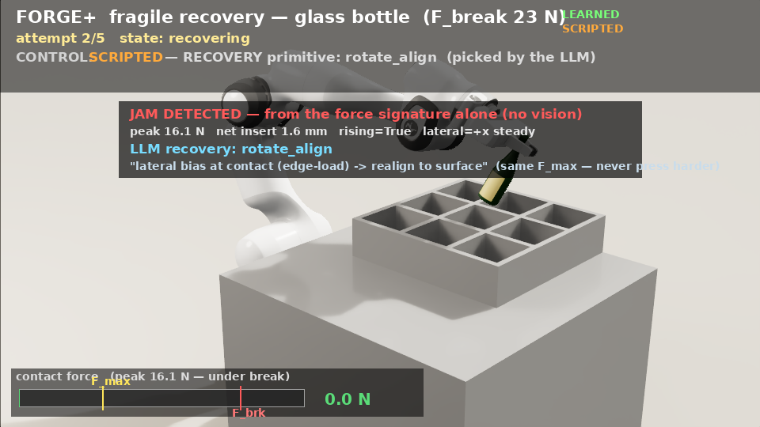

# 06 — Force-signature LLM recovery (closed loop, in Isaac)

> **✅ Status — the recovery loop now drives the LEARNED FORGE policy.** `step_skill()` runs the
> trained PPO insertion policy (`checkpoints/task3_forge_entrance.pt`, `forge_mode`), not the old
> zero-action scaffold. The same task-agnostic loop + LLM recovery selection sit on top. Use
> `--scripted` to fall back to the zero-action base-aim skill (the original scaffold) for
> comparison. See §5 for the learned-policy results and §7 for the **rendered fragile-object
> recovery episode**: [`docs/videos/task3/forge_recovery.mp4`](../videos/task3/forge_recovery.mp4).

<div align="center">
  
  <br><em>The rendered recovery moment: jam caught from the force signature at 16.1 N (break 23.3 N),
  the LLM picks <code>rotate_align</code>, and the arm — bottle still held — realigns before the
  LEARNED policy re-inserts, seats it, releases, and retracts.</em>
</div>

The proposal's **recovery layer** (§07), now active on the **real contact-rich Isaac env**: when
an insertion jams, the system reads a **text force/contact signature** (no vision, no `F_break`),
a frozen LLM picks a recovery action from a fixed menu, the robot applies it **within the same
`F_max`**, and retries — up to `k_max` attempts. This closes the gap noted in earlier docs (the
recovery code existed but was only exercised in the CPU mock env).

Files: `forge_plus/recovery/recovery_loop.py` (the loop), `forge_plus/llm/recovery_selector.py`
(the LLM call), `forge_plus/isaac_pick_place_env.py` (the env hooks),
`scripts/run_recovery_insertion.py` (the demo), `tests/test_recovery_loop.py` (CPU test).

## 1. Architecture — one loop, every task env

The loop is **task-agnostic**: each task has its own Isaac env, but they all plug into one
orchestrator through a tiny protocol (`RecoveryEnv`). `RecoveryLoop.run(env)`:

```
reset episode
for attempt in range(k_max):
    while steps < max_steps_per_attempt:
        env.step_skill()                 # nominal skill = the LEARNED FORGE policy (or scripted OSC)
        if env.is_success(): return SUCCESS
        if env.is_failure(): break       # jam / over-force / no-progress
    sig = env.failure_signature()        # TEXT force signature — no vision, no F_break
    decision = RecoverySelector.select(sig, f_max, attempt, subphase, gripper)
    if decision.action == "abort": return ABORTED
    env.apply_recovery(decision.action, decision.params)   # F_max NEVER relaxed
return FAIL_NO_ATTEMPTS_LEFT
```

To make a new task env recoverable, implement the `RecoveryEnv` hooks on it — nothing in the loop
or the LLM layer changes. (Scope note: as everywhere in Task 3, this is the **terminal micro-phase**
with **no vision** and **poses assumed known**; see [`05-wine-cellar-insertion.md`](05-wine-cellar-insertion.md) and the root proposal §01.)

## 2. The env hooks (`FrankaPickPlaceEnv`)

| Hook | What it does |
|---|---|
| `step_skill()` | One control step under the **learned FORGE policy** (`env._skill_policy`), sampled from its action distribution (as the renderer runs it — the deterministic mean is shy and stalls). Falls back to zero-action OSC if no policy is loaded. |
| `is_success()` | Geometric seat: base centered in the cell **and** at the cell floor. |
| `is_failure()` | **Jam**: contact ≥ `max(jam_force_n, jam_force_frac·F_max)` with **no net descent** (`< jam_progress_mm`) over a **sustained** window (`jam_window` = 40 steps). In `forge_mode` the gate is "setup done **and** near the cell mouth" (forge doesn't advance the phase machine). |
| `failure_signature()` | A `ForceSignature` from a contact+pose **ring buffer**: peak/mean axial force, net insertion (mm), rising trend, lateral bias, slip events, contact persistence. **No images, no `F_break`.** |
| `apply_recovery(action, params)` | OSC maneuvers (below). Sets `F_max`-preserving target offsets; **never changes `F_max`**. |

**How the learned skill routes through the hooks.** In `forge_mode` the EE target comes from
`_forge_targets` (the policy's bounded per-step delta), which *overrides* the scripted waypoint
path — so the induced jam and the recovery maneuver are injected **inside `_forge_targets`**
(guarded so they are inert whenever no jam is configured and no recovery is running, i.e. in all
normal training/rendering). The jam base-aims the bottle at an off-center wedge point; a recovery
drives the hand to a fixed clear pose above the cell (entrance height + the recovery offset) and
then hands back to the policy, which re-descends now that the misalignment is cleared.

**Recovery primitives** (the fixed menu → OSC motions):
- `retract_and_reapproach` — lift the EE clear of the rim (`rec_lift`), then re-approach; base-aim re-centers on the way back down.
- `wiggle_search` — a small lateral oscillation (`rec_lat`) while lifted, to find the hole.
- `rotate_align` — nudge the bottle **base toward the cell center** (counteracts a lateral wedge) + lift slightly.
- `regrasp` — re-seat the bottle in the gripper (reuse the warmup seat) + lift.
- `abort` — the loop stops before applying anything (never risks the part).

## 3. Force authority — staying under budget (FORGE)

The key faithfulness point: a jam must be caught **well below the break force** (`F_break`). Two
mechanisms keep it there and make the wedge legible:

- **Force authority (FORGE).** In `_forge_targets` the descent target-z **freezes** once the
  filtered insertion force exceeds the object budget, so the policy cannot ram the wedge deeper —
  the contact force plateaus instead of climbing toward break. A recovery clears the misalignment,
  so the freeze never deadlocks.
- **A jam is a wedge, not a force spike.** The learned insertion is genuinely contact-rich — it
  grinds the bottle into the tight cell at ~14 N with brief no-descent phases even on a *clean*
  seat. So the detector keys on the real invariant — **sustained no descent** — not on force
  alone: `jam_window` = 40 steps of `< 2 mm` net descent, with the force merely above a **low**
  fraction of budget (`jam_force_frac` = 0.18 → ~13 N on the robust object). That catches a real
  wedge (17 N, never descends) while a clean grind (which *does* net-descend over 40 steps, or
  seats and trips `is_success` first) passes through.

Because the detector is deliberately **conservative** (a slow-but-fine grind can trip it) and the
recovery is **benign** (lift + realign, always within `F_max`), a false positive costs only an
extra attempt — the loop still converges to a seated bottle. Everything is caught **far below
`F_break`** (14–17 N vs the robust object's 180 N; a fragile 22 N object would be caught at ~9 N).

## 4. The induced-jam scenario

To exercise the loop, `cfg.jam_dx` (a lateral base-aim error, m) makes the bottle **wedge on the
cell rim**: in `_forge_targets` the bottle base is aimed at a point `jam_dx` off the cell center,
so as the learned policy descends it wedges (high contact, no descent). It is gated by
`self._jam_on`, which a recovery clears — modeling a **corrected approach** (the recovery
realigned the insertion). Set `--jam 0.0` for the clean insertion; note the learned skill is
imperfect (~68 %/attempt) and **also** relies on the loop's retries to seat reliably (see §5).
This is a deliberately simple, controllable failure; richer jam models (angular catch, burr) are
future work.

> **Object choice.** The recovery demo runs on the **robust** class (`--obj 2`, metal_plate,
> `F_break` 180 N) because the learned policy reliably *seats* it. The truly **fragile** glass
> (`--obj 0`, `F_break` 22 N, budget 8.8 N) is where the recovery story is sharpest — the jam is
> caught at ~9 N, well below break — **but the learned policy cannot seat the fragile object**: the
> low force budget freezes the descent before it bottoms out (the known open fragile-insertion gap,
> see doc 07). So the robust object is used to show the *closed loop end-to-end on the learned
> policy*; the fragile force-authority story is validated separately in the scripted demo.

## 5. Verified result

`scripts/run_recovery_insertion.py --jam 0.05 --obj 2 --backend heuristic` — the **learned FORGE
policy** driving the insertion (no API key, no GPU vision):

```
skill = LEARNED FORGE policy (checkpoints/task3_forge_entrance.pt)
jam_dx = 0.050 m   F_max (robust) — F_break 180 N     backend = heuristic
attempt 0: failure  [peak_axial=16.6N  net_insert=1.6mm  rising=True]  -> retract_and_reapproach
attempt 1: failure  [peak_axial=13.9N  net_insert=2.0mm  rising=True]  -> retract_and_reapproach
attempt 2: success
final bottle base (env frame): (0.447, 0.105, 0.429)   cell=(0.45, 0.12, 0.40)
OUTCOME: SUCCESS in 3 attempts
```

- The wedge is caught **from the force signature alone** (no vision), at **peak ~17 N — far below
  the 180 N break** (force authority held; no breakage), and the recovery is applied **within the
  same `F_max`** (`F_max` never relaxed).
- Each recovery lifts the hand clear, and the **learned policy re-descends** and finally **seats**
  the bottle: base centered, at the cell floor.
- **Clean insertion** (`--jam 0.0`) also reaches `SUCCESS` — but typically in **2–3 attempts**,
  because the learned skill is imperfect (~68 %/attempt) and its contact-rich grind trips the
  conservative jam detector; the loop's benign lift-and-retry seats it. This is the honest value of
  the layer: **it makes an imperfect learned insertion reliable**, whether the stall came from an
  induced misalignment or the policy's own marginality.

The same loop is validated on a CPU fake env in `tests/test_recovery_loop.py` (jam → signature →
`rotate_align` → recover → success; budget never relaxed; unrecoverable jam escalates to `abort`).

## 6. Run it

```bash
export HOME=/workspace/persist/ovhome MPLBACKEND=Agg DISPLAY=:99 PYTHONPATH=/workspace/FORGE-plus_task3
# closed-loop recovery driving the LEARNED policy on a wedged insertion:
/workspace/.venv/bin/python scripts/run_recovery_insertion.py --jam 0.05 --obj 2 --backend heuristic
# clean insertion (no induced jam) — still learned-policy driven:
/workspace/.venv/bin/python scripts/run_recovery_insertion.py --jam 0.0 --obj 2
# fall back to the original SCRIPTED zero-action skill (for comparison):
/workspace/.venv/bin/python scripts/run_recovery_insertion.py --jam 0.05 --scripted
# real local LLM instead of the heuristic:  --backend local   (Ollama)
```

Backends: `heuristic` (deterministic, force-reasoned, no API), `local` (Ollama), `anthropic`
(API key). All read only the text force signature — the recovery never sees an image.

## 7. The rendered fragile-object recovery episode

**Video: [`docs/videos/task3/forge_recovery.mp4`](../videos/task3/forge_recovery.mp4)** (~13 s).
`scripts/render_recovery.py` (retry wrapper `scripts/render_recovery_until_success.sh`) renders
the closed loop **on the fragile glass object** (`--obj 0`, per-episode sampled `F_break` ≈ 22 N,
budget `F_max` 8.8 N) with the induced jam, through to the **full place**: after the recovery
seats the bottle, the policy **releases** (its learned decision, sampled) and the hand retracts
clear. Built on the proven `render_forge_min.py` RTX harness (numpy 1.26, GI/DLSS off — see doc
07 §5); the recovery portion is driven end-to-end by `RecoveryLoop.run(env, on_step=capture)` —
the render loop never touches the control.

Why the fragile object works *here* but not in the single-shot demo: one attempt usually stalls
under the low budget (the force-freeze), but the loop's **retries are exactly the missing piece**
— the verified take seats it in 2 attempts with **peak insertion force 16.1 N ≪ 23.3 N break**
(jam → `rotate_align` → the learned policy re-descends dead-center and seats it, still held).

The HUD keeps the honesty rules from doc 07 §6 and adds the recovery story:
- **CONTROL line** — `SCRIPTED — approach positioning` (orange) → `LEARNED — force-guided
  insertion (PPO policy)` (green) → `SCRIPTED — RECOVERY primitive: <action> (picked by the LLM)`
  (orange) → back to LEARNED for the re-insertion → `SEATED — deciding when to release (PPO)`
  (green) → `RELEASED / SCRIPTED — gripper-open + retract-to-clear (release was LEARNED)`
  (orange) → `PLACED`.
- **JAM DETECTED card** (flashes ~2 s) — the actual `ForceSignature` values the LLM saw (peak
  axial N, net insert mm, rising, lateral bias), the chosen action, and its rationale, labeled
  *"from the force signature alone (no vision)"* and *"same F_max — never press harder"*.
- **Force gauge** — shows `_insertion_force()` (the same bottle↔rack channel that gates breakage
  and the FORGE budget freeze, so the bar, the `F_max`/`F_brk` markers, and the BREAK state are
  mutually consistent), plus a running *peak N — under break* readout.
- An *induced misalignment* note is shown while the seeded fault is live (the demo's jam is
  deliberately injected; the recovery is not).

```bash
# render until a take passes the full gate (validated seat -> learned release -> retract clear):
bash scripts/render_recovery_until_success.sh 8
# knobs (env vars): JAM=0.05 OBJ=0 K_MAX=5 CAP_EVERY=1 TAKE=n CKPT=... OUT=...
# takes encode to /workspace/render_takes/forge_recovery_take_NNN.mp4; only the approved
# take is copied over the stable docs/videos/task3/forge_recovery.mp4
```

**Take gate (honesty guards, in `render_recovery.py`):**
- *Seat validation*: the loop's SUCCESS only counts if the bottle is in the cell at the floor
  **while still held** (finger gap ≈ the bottle neck, no release latched). A bottle that slipped
  and happened to fall into the cell is a lucky drop, not a place — rejected.
- *Finale*: the release dim is **gated off during the loop** (`step_skill` drives `act[7]=-1`) —
  on this untrained object class the release head misfires in out-of-distribution states (e.g.
  mid-air during the post-recovery re-descent, which drops the bottle). Once seated, the finale
  samples the policy's **own release distribution**; if it doesn't fire within the window, or the
  bottle settles leaning (`up_z < 0.90`), the take is rejected and re-rolled.
- `RESULT SUCCESS` therefore means: recovery seated it under budget, the policy let go, the
  bottle stands upright, and the hand retracted clear.

Reliability: headless, **9/9 recovery episodes on the fragile object seat the bottle** (2–3
attempts each, breaks 0) — the loop makes the under-budget fragile insertion reliable even though
a single attempt rarely seats it. The rendered *full-place* gate is stricter (upright settle after
a release the head was never trained to time on this object): ~1 in 3 takes passes end-to-end.
