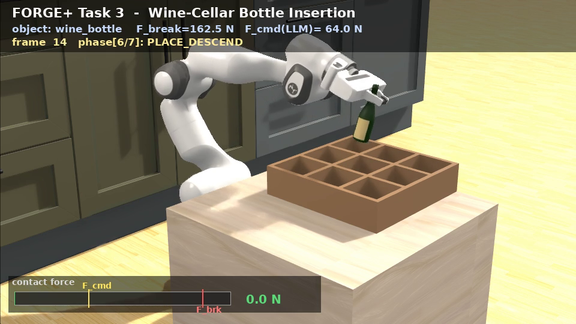

# Task 3 — Fragile Object Placement (Franka + Isaac Lab)

> **Naming note:** this is a *placement* task — the robot does **not** pick the object off a
> surface. The code keeps `pick_place` names (`FrankaPickPlaceEnv`, `*_pick_place.py`,
> gym id `FORGE-PickPlace-v0`) because the env *implements* the full pick→place pipeline, but we
> run it in `place_only=True` mode. See the "Pick vs place" box below.

> Read this first. This folder documents **everything** about FORGE-plus Task 3: the
> algorithm, the grasp/place physics, the headless RTX rendering pipeline, and how the
> realistic LIBERO objects are imported. It is written for engineers *and* for other AI
> coding agents picking up this work — every section records the *why*, not just the *what*,
> and calls out the hard-won gotchas that each cost hours to find.

## What this task is

A Franka Panda arm performs a **fragile PLACE** of a realistic, breakable kitchen object (a
LIBERO wine bottle). The current demonstrated variant is a **wine-cellar peg-in-hole insertion**:
the arm carries the bottle to a wood wine-rack and **inserts it into a cell**, ending standing
perfectly vertical (tilt ≈ 0°) on the cell floor — a clean, gentle, contact-rich placement with
no flick. See **[`05-wine-cellar-insertion.md`](05-wine-cellar-insertion.md)**.



The earlier variant set the bottle on an **open shelf** and righted it about the contact pivot
(force-conditioned policy + "contact-then-verticalize"). Both run with **real physics** — the
object is a dynamic rigid body held by a genuine friction grip, never teleported or kinematically
attached during the carry. The placement strategy is selected by `cfg.place_strategy`:

| `place_strategy` | What it does | Status |
|---|---|---|
| `"insert"` (current) | Wine-cellar peg-in-hole — insert the bottle into a rack cell | ✅ bottle ends vertical, doc 05 |
| `"throw_upright"` | Open-shelf place + contact-then-verticalize ramp | ✅ stands (~0.8°), doc 02 §9 |
| `"extrinsic"` | Learned gentle roll-up (extrinsic dexterity) | ⚠️ never converged (abandoned) |

> ### ⚠️ Pick vs place — read this so you don't overclaim
> We run the env in **`place_only=True`** mode: the episode **starts already holding the object**.
> The object is seated into the closed gripper during a brief warmup (a short teleport) and then
> held by **real friction** for the rest of the episode. The robot does **not** reach down and
> close on an object from a surface — **there is no learned/executed pick maneuver.** When these
> docs say "grasp," they mean the **friction hold** (genuine physics, no kinematic attach), not a
> pick. The full pick pipeline (`PRE_GRASP → DESCEND → GRASP → LIFT`) exists in the code
> (`place_only=False`) but is **not trained or rendered**. The "Pick & Place" name is historical
> (`FrankaPickPlaceEnv`, `*_pick_place.py`); the demonstrated/trained task is the fragile **place**.
> The render HUD still reads "Fragile Pick & Place" — relabel to "Fragile Place" when convenient.

## Where it runs

Isaac Sim / Isaac Lab on a remote RunPod GPU pod. See the repo-root `CLAUDE.md` for pod
orientation (clones, shared venv, asset dirs, push/auth). Run all Isaac code with
`/workspace/.venv/bin/python`.

## Document map

| Doc | Covers |
|-----|--------|
| [`01-algorithm.md`](01-algorithm.md) | FORGE algorithm, OSC controller, the 7-phase state machine, force budgets (LLM cache), reward shaping, PPO training, and the reward-hovering fix. |
| [`02-grasp-and-placing.md`](02-grasp-and-placing.md) | Grasp physics (why flat faces work and round ones fail), the friction seat, geometric place detection, the gripper-release bug, the retract, and the standing-placement (topple) problem + object-selection rules. |
| [`03-rendering.md`](03-rendering.md) | Headless RTX live-physics rendering, the "app.update() steps physics" gotcha, the render↔physics **sync bug** that froze the object, the proven render loop, camera, and HUD. |
| [`04-libero-objects.md`](04-libero-objects.md) | LIBERO reference, the OBJ→USD→rigid-wrap import pipeline, the **procedural wine-rack USD build**, asset layout, and which object shapes to pick. |
| [`05-wine-cellar-insertion.md`](05-wine-cellar-insertion.md) | **The current task.** Wine-cellar peg-in-hole: the rack scene, the three tricks (base-aim, firm grip, wide cell) that seat the bottle vertical, success detection, the zero-action render, photorealism, and troubleshooting. |

## Key files

| Path | Role |
|------|------|
| `forge_plus/isaac_pick_place_env.py` | The env: `PickPlaceEnvCfg`, `FrankaPickPlaceEnv`, `PickPlacePhase`. Spawn, OSC, phases, grip, reward, dones, reset. |
| `forge_plus/skills/policy_network.py` | `ForceConditionedPolicy`, `PolicyConfig`, `ValueNetwork`. |
| `scripts/train_pick_place.py` | PPO training entry point. |
| `scripts/render_pick_place.py` | Headless RTX renderer → demo mp4 with HUD. |
| `llm/budget_cache.json` | Cached per-object force budgets (avoids re-querying the LLM each run). |
| `checkpoints/task3_wine_bottle.pt` | Trained policy (gitignored — not in the repo; regenerate via training). |
| `/workspace/assets/libero/wine_bottle/wine_bottle_rigid.usd` | The graspable object (outside the repo; `assets/` is gitignored). |
| `/workspace/assets/libero/wine_rack/wine_rack.usd` | The procedural 3×3 wine-cellar rack (outside the repo; `assets/` is gitignored). See doc 04 §7. |
| `docs/videos/task3/pick_place_eval_001.mp4` | Latest demo render (wine-cellar insertion). |

## Quickstart

```bash
# After every pod (re)start, once:
cd /workspace/FORGE-plus_task3
gcc -shared -fPIC -o /usr/local/lib/libGLU.so.1 scripts/libglu_stub.c && ldconfig
bash scripts/setup_runtime.sh
export HOME=/workspace/persist/ovhome MPLBACKEND=Agg DISPLAY=:99 PYTHONPATH=/workspace/FORGE-plus_task3

# Train (warm-start optional). ~256 envs fits the bottle's heavier collision mesh.
/workspace/.venv/bin/python scripts/train_pick_place.py \
    --num_envs 256 --iterations 600 --gripper franka_panda \
    --ckpt checkpoints/task3_wine_bottle.pt

# Render the wine-cellar insertion demo (zero-action OSC; cfg.place_strategy="insert"):
/workspace/.venv/bin/python scripts/render_pick_place.py
# -> docs/videos/task3/pick_place_eval_001.mp4
```

> The insertion render drives **zero actions** (the env's base-aim + firm grip + cell geometry
> carry the insertion); it does **not** call the policy (obs is now 37-dim — see doc 05 §5). The
> open-shelf `"throw_upright"` variant *does* drive the trained policy.

## Current status (2026-06-27)

- ✅ **Wine-cellar peg-in-hole insertion** (current demo): the arm inserts the bottle into a rack
  cell; it ends **standing perfectly vertical** (tilt 0.0°, base seated on the cell floor,
  dead-centered, contact force ≈ 0 N — no jam) → release → retract. Real physics. See
  [`05-wine-cellar-insertion.md`](05-wine-cellar-insertion.md).
- ✅ Real friction grasp of a realistic LIBERO wine bottle (gripped by the neck).
- ✅ Headless RTX render (kitchen backdrop, wood counter, wood rack) with the object correctly
  following the gripper on screen; gripper genuinely **releases** and the arm **retracts** away.
- ✅ (Prior variant) **Bottle places STANDING upright** on an open shelf (final tilt ~0.8°) via
  **contact-then-verticalize**, and a force-conditioned policy trained to **succ 1.0 / break 0.0**.
  See [`02-grasp-and-placing.md`](02-grasp-and-placing.md#9-standing-placement-solved-via-contact-then-verticalize).
- ⚠️ Learned gentle "extrinsic-dexterity" roll-up was attempted and **never converged**
  (hard-exploration RL) — superseded by the cell-geometry insertion.

## The one-paragraph mental model

The episode runs a fixed **phase state machine** (LIFT→TRANSPORT→PLACE_DESCEND→RELEASE in
`place_only` mode). Each phase has a **waypoint**; an **Operational-Space Controller (OSC)**
drives the end-effector toward `waypoint + policy_delta` with bounded per-step motion. The
gripper open/close is **scheduled by phase** (not the policy). The object is a **dynamic rigid
body** seated into the gripper during a short warmup and then held by **real friction**. The
policy's job is to modulate the approach/descent so the **contact force stays under the budget**
(fragility) while still completing the place. Reward = sparse success cliff + small shaping; the
critical lesson was that *any farmable per-step bonus* makes the policy hover forever instead of
finishing (see [`01-algorithm.md`](01-algorithm.md#reward-shaping-and-the-hovering-trap)).
